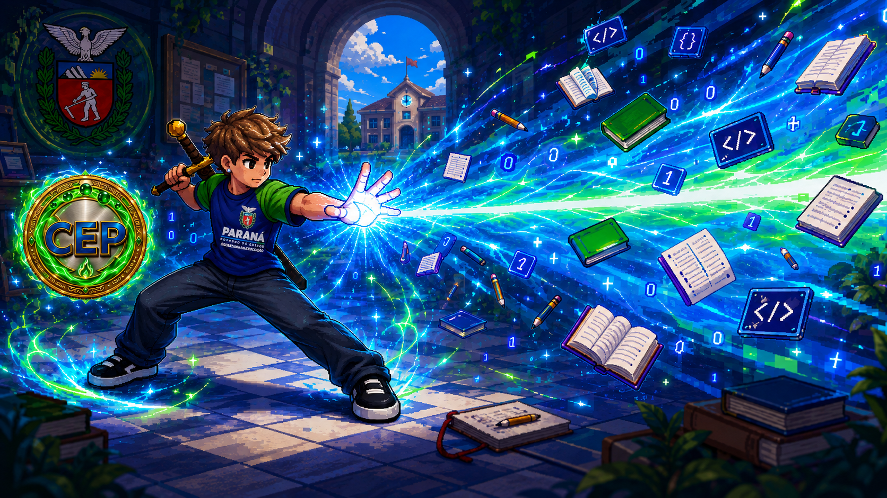
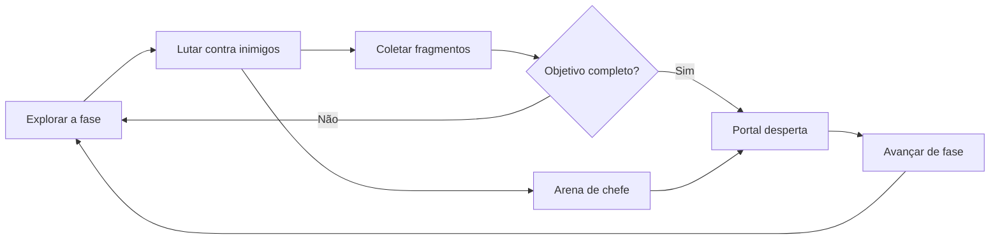
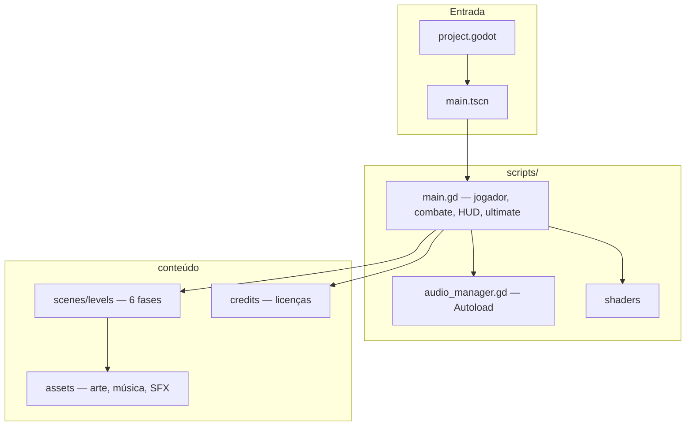
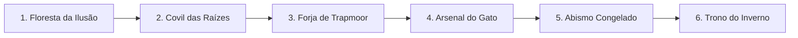

<div align="center">



# Jorginho: Jornada Sem Retorno

**Trabalho de Conclusão de Curso · Jogos Digitais**

Colégio Estadual de Paranavaí — E.F.M.N.P. · CEP

[](https://godotengine.org/)
[](#)
[](#)
[](#)

Plataforma 2D de ação em pixel art.

Explorar → lutar → coletar fragmentos → despertar o portal → avançar.

</div>

---

## Ficha acadêmica

| | |
| :--- | :--- |
| **Aluno** | Gustavo Bento Ouverney — ideia, direção, programação e TCC |
| **Professor responsável** | Jackson A. Z. Savoldi — estrutura do GitHub e arquitetura do jogo |
| **Orientador** | Carlos Alcantara — orientação acadêmica |
| **Curso / instituição** | Jogos Digitais · Colégio Estadual de Paranavaí — E.F.M.N.P. |
| **Engine / versão** | Godot 4.7 · 2.0.0 |

> **Jackson A. Z. Savoldi** acompanhou a organização do repositório (pastas, documentação, créditos e publicação) e a arquitetura: cena principal, sistemas, fases editáveis e a separação entre código, assets e licenças. A implementação abaixo foi feita nessa linha de trabalho.

---

## O que implementamos com o professor Jackson

Orientação de estrutura e arquitetura: **Jackson A. Z. Savoldi**.  
Código e direção de jogo: **Gustavo Bento Ouverney**.

| Frente | O que ficou no jogo |
| :--- | :--- |
| **Repositório e TCC** | Pastas limpas, `docs/`, créditos, `.gitignore` e publicação no GitHub |
| **Arquitetura** | Um `main.tscn` + `main.gd`, áudio em Autoload, seis fases TileMap editáveis |
| **Jorginho** | Folhas 256×256, escala calibrável, poses paradas, pés alinhados ao chão e às plataformas |
| **Fragmentos CEP** | Moeda girando, sucção até a barra e portal que só abre com todos os fragmentos |
| **Combate** | Ataque em combo, guarda, parry, dash, pulo duplo e arenas de chefe |
| **Queda alta** | Rachadura, fumaça e pedras atrás dos pés ao cair do ponto mais alto até o chão |
| **Ultimate** | Explosão de conhecimento (tecla **U**): 10 moedas para a primeira carga; o custo dobra depois; dano ×4; CEP e brasão no feixe |
| **Prólogo** | Cutscene RPG do Limiar, sem o herói inchando ao ser puxado pelo portal |
| **Calibração** | Constantes no topo de `main.gd` e guia em [docs/AJUSTE_PES_PLATAFORMA.md](docs/AJUSTE_PES_PLATAFORMA.md) |

A capa do projeto (`capa_projeto.png`) mostra essa ultimate: livros, código, CEP e o Paraná no feixe do Jorginho.

---

## Ciclo de jogo



Nas arenas de chefe o portal só aparece depois da derrota do Guardião.

---

## Arquitetura



| Camada | Onde | Função |
| :--- | :--- | :--- |
| Motor | `project.godot` | Nome, versão, InputMap, Autoload |
| Cena | `main.tscn` | Entrada do jogo |
| Gameplay | `scripts/main.gd` | Player, combate, portal, chefes, HUD, ultimate |
| Áudio | `scripts/systems/audio_manager.gd` | Música e SFX com fade |
| Fases | `scenes/levels/` | Seis mapas editáveis no Godot |
| Arte | `assets/` | Sprites, tiles, UI, músicas e SFX |
| Licenças | `credits/` | Textos e PDFs dos pacotes |
| Capa | `capa_projeto.png` | Imagem de capa do TCC / README |
| Docs | `docs/` | Como rodar, créditos, guia e histórico |

---

## Como executar

Passo a passo: **[docs/COMO_RODAR.md](docs/COMO_RODAR.md)**. Exportar `.exe`: [docs/COMO_EXPORTAR.md](docs/COMO_EXPORTAR.md).

| | |
| :---: | :--- |
| **1** | Instalar o [Godot 4.7](https://godotengine.org/download) (Standard, estável) |
| **2** | Clonar este repositório |
| **3** | No Godot, **Importar** a pasta `Jorginho_Jornada_Sem_Retorno` |
| **4** | Pressionar **F5** |

```bash
git clone git@github.com:gouverney8/tcc_colegio_estadual.git
cd tcc_colegio_estadual
```

---

## Controles

Remapeáveis no menu de configurações.

| Ação | Teclado | Controle |
| :--- | :--- | :---: |
| Andar | `A` `D` ou setas | Analógico / D-pad |
| Pular e pulo duplo | `Espaço` `W` ou ↑ | **A** |
| Atacar | Clique esquerdo, `J` ou `Z` | **X** |
| Guardar / aparar | Clique direito ou `K` | **LB** |
| Impulso | `Shift` | **B** |
| Ultimate | `U` | **Y** |
| Pausar | `Esc` | **Start** |
| Avançar fase (desenvolvedor) | `K` + `J` | — |

A primeira ultimate pede **10 fragmentos** coletados na jornada. Depois o custo **dobra** (20, 40…). Os fragmentos do portal **não são gastos**. Só ativa no chão. Dano = ataque normal × 4.

### Dificuldades

| | Nome | Perfil |
| :---: | :--- | :--- |
| 1 | Trilha dos Vaga-Lumes | Ritmo mais guiado |
| 2 | Passos pelo Limiar | Ritmo original |
| 3 | Jornada sem Retorno | Combate mais exigente |
| 4 | Eclipse do Último Portal | Maior pressão de dano e chefes |

---

## Campanha

Seis fases em `Jorginho_Jornada_Sem_Retorno/scenes/levels`. TileMap, início, portal, fragmentos e inimigos se editam no Godot.



| | Cena | Bioma |
| :---: | :--- | :--- |
| 1 | `fase_01_floresta_da_ilusao.tscn` | Floresta |
| 2 | `fase_02_covil_das_raizes.tscn` | Raízes / covil |
| 3 | `fase_03_forja_de_trapmoor.tscn` | Forja |
| 4 | `fase_04_arsenal_do_gato.tscn` | Arsenal |
| 5 | `fase_05_abismo_congelado.tscn` | Gelo |
| 6 | `fase_06_trono_do_inverno.tscn` | Trono de inverno |

---

## Estrutura do repositório

Organização acompanhada nas orientações de GitHub do professor **Jackson A. Z. Savoldi**.

```
tcc_colegio_estadual/
├── README.md
├── capa_projeto.png                       capa do TCC e deste README
├── docs/
│   ├── COMO_RODAR.md
│   ├── COMO_EXPORTAR.md
│   ├── CREDITOS.md
│   ├── GUIA_DO_PROJETO.md
│   ├── CHANGELOG.md
│   ├── AJUSTE_PES_PLATAFORMA.md
│   ├── HEROI_SPRITES.md
│   └── atividade-amostra-de-cursos-2026.docx
└── Jorginho_Jornada_Sem_Retorno/          projeto Godot
    ├── project.godot
    ├── main.tscn
    ├── scenes/levels/
    ├── scripts/
    ├── assets/
    └── credits/
```

| Documento | Conteúdo |
| :--- | :--- |
| [Como rodar](docs/COMO_RODAR.md) | Instalação do Godot e execução |
| [Como exportar](docs/COMO_EXPORTAR.md) | Executável Windows |
| [Guia do projeto](docs/GUIA_DO_PROJETO.md) | Sistemas e roteiro de apresentação |
| [Créditos](docs/CREDITOS.md) | Autoria e pacotes de terceiros |
| [Histórico](docs/CHANGELOG.md) | Evolução do jogo |
| [Ajustes manuais](docs/AJUSTE_PES_PLATAFORMA.md) | Pés, escala, ultimate e prólogo |
| [Sprites do Jorginho](docs/HEROI_SPRITES.md) | Folhas novas e como desfazer |

---

## Créditos

Código, direção e TCC: **Gustavo Bento Ouverney**.  
Estrutura do repositório e arquitetura: orientação de **Jackson A. Z. Savoldi**.  
Orientação acadêmica: **Carlos Alcantara**.

Arte, música e SFX de Kenney, ElvGames, Ozzbit Games, Analog Studios, CraftPix, AlkaKrab e outros. Lista completa:

- **[docs/CREDITOS.md](docs/CREDITOS.md)**
- **[Jorginho_Jornada_Sem_Retorno/credits/](Jorginho_Jornada_Sem_Retorno/credits/)**

Projeto educacional. Antes de republicar ou comercializar, confira os termos de cada pacote.

---

<div align="center">

**Colégio Estadual de Paranavaí — E.F.M.N.P.**  
Curso de Jogos Digitais · TCC 2026

Gustavo Bento Ouverney · Jackson A. Z. Savoldi · Carlos Alcantara

</div>
