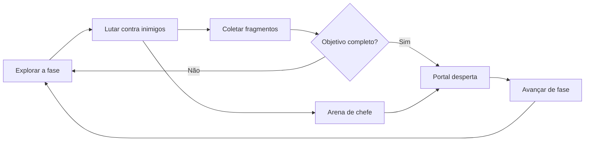
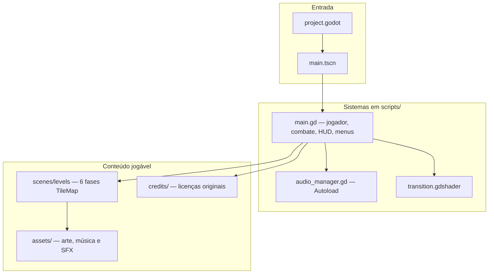
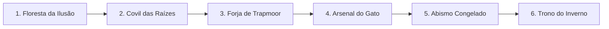

<div align="center">

# Jorginho: Jornada Sem Retorno

**Trabalho de Conclusão de Curso · Jogos Digitais**

Colégio Estadual de Paranavaí — E.F.M.N.P.

[](https://godotengine.org/)
[](#)
[](#)
[](#)

Jogo de ação e plataforma 2D em pixel art.

Explorar → lutar → coletar fragmentos → despertar o portal → avançar.

</div>

---

## Ficha acadêmica

<table>
  <tr>
    <td width="50%" valign="top">

**Identificação**

| | |
| :--- | :--- |
| **Aluno** | Gustavo Bento Ouverney |
| **Professor responsável** | Jackson A. Z. Savoldi |
| **Orientador** | Carlos Alcantara |
| **Curso** | Jogos Digitais |
| **Instituição** | Colégio Estadual de Paranavaí — E.F.M.N.P. |
| **Engine** | Godot 4.7 |
| **Versão** | 2.0.0 |

    </td>
    <td width="50%" valign="top">

**Papéis no projeto**

| Nome | Atuação |
| :--- | :--- |
| **Gustavo Bento Ouverney** | Ideia, direção, programação e TCC |
| **Carlos Alcantara** | Orientação acadêmica do trabalho |
| **Jackson A. Z. Savoldi** | Professor responsável; orientação de estrutura do GitHub e de arquitetura do jogo |

    </td>
  </tr>
</table>

> **Jackson A. Z. Savoldi** orientou a organização deste repositório (pastas, documentação, créditos e publicação) e a arquitetura do jogo (cena principal, sistemas, fases editáveis e separação entre código, assets e licenças).

---

## Ciclo de jogo



Nas arenas de chefe o portal permanece invisível até a derrota do Guardião. Depois disso ele aparece com luz, som e animação.

---

## Arquitetura do jogo

Orientação de estrutura: **Jackson A. Z. Savoldi**. Implementação: **Gustavo Bento Ouverney**.



| Camada | Pasta / arquivo | Função |
| :--- | :--- | :--- |
| Motor | `project.godot` | Nome, versão 2.0.0, InputMap, Autoload de áudio |
| Entrada | `main.tscn` | Cena principal do jogo |
| Gameplay | `scripts/main.gd` | Player, combate, portal, chefes, HUD e menus |
| Áudio | `scripts/systems/audio_manager.gd` | Música e efeitos com fade |
| Fases | `scenes/levels/` | Seis mapas editáveis no editor |
| Arte | `assets/` | Sprites, tiles, UI, músicas e SFX usados no runtime |
| Licenças | `credits/` | Textos e PDFs originais dos pacotes de terceiros |
| Documentação | `docs/` | Como rodar, créditos, guia e atividade da amostra |

---

## Como executar

O passo a passo completo está em **[docs/COMO_RODAR.md](docs/COMO_RODAR.md)**.

| Etapa | O que fazer |
| :---: | :--- |
| **1** | Instalar o [Godot 4.7](https://godotengine.org/download) (versão estável, Standard) |
| **2** | Clonar este repositório |
| **3** | No Godot, **Importar** a pasta `Jorginho_Jornada_Sem_Retorno` (`project.godot`) |
| **4** | Pressionar **F5** para jogar |

Para gerar um `.exe` do Windows: [docs/COMO_EXPORTAR.md](docs/COMO_EXPORTAR.md).

```bash
git clone git@github.com:gouverney8/tcc_colegio_estadual.git
cd tcc_colegio_estadual
```

---

## Controles

Os comandos podem ser remapeados no menu de configurações.

| Ação | Teclado | Controle |
| :--- | :--- | :---: |
| Andar | `A` `D` ou setas | Analógico / D-pad |
| Pular e pulo duplo | `Espaço` `W` ou ↑ | **A** |
| Atacar | Clique esquerdo, `J` ou `Z` | **X** |
| Guardar / aparar | Clique direito ou `K` | **LB** |
| Impulso | `Shift` | **B** |
| Pausar | `Esc` | **Start** |
| Avançar fase (modo desenvolvedor) | `K` + `J` ao mesmo tempo | — |

### Dificuldades

| Limiar | Nome | Perfil |
| :---: | :--- | :--- |
| 1 | Trilha dos Vaga-Lumes | Ritmo mais guiado, inimigos mais brandos |
| 2 | Passos pelo Limiar | Ritmo original da jornada |
| 3 | Jornada sem Retorno | Combate mais exigente |
| 4 | Eclipse do Último Portal | Maior pressão de dano, velocidade e chefes |

---

## Campanha

Seis fases em `Jorginho_Jornada_Sem_Retorno/scenes/levels`. Cada cena tem TileMap, início do Jorginho, posição do portal, fragmentos, inimigos e vidas escondidas. Mudar esses marcadores no editor muda a fase de verdade.



| Fase | Cena | Bioma |
| :---: | :--- | :--- |
| 1 | `fase_01_floresta_da_ilusao.tscn` | Floresta |
| 2 | `fase_02_covil_das_raizes.tscn` | Raízes / covil |
| 3 | `fase_03_forja_de_trapmoor.tscn` | Forja |
| 4 | `fase_04_arsenal_do_gato.tscn` | Arsenal |
| 5 | `fase_05_abismo_congelado.tscn` | Gelo |
| 6 | `fase_06_trono_do_inverno.tscn` | Trono de inverno |

---

## Estrutura do repositório

Organização acompanhada nas orientações de GitHub do professor **Jackson A. Z. Savoldi**.

```
tcc_colegio_estadual/
├── README.md
├── docs/                                  documentação final do TCC
│   ├── COMO_RODAR.md
│   ├── COMO_EXPORTAR.md
│   ├── CREDITOS.md
│   ├── GUIA_DO_PROJETO.md
│   ├── CHANGELOG.md
│   ├── AJUSTE_PES_PLATAFORMA.md
│   └── atividade-amostra-de-cursos-2026.docx
└── Jorginho_Jornada_Sem_Retorno/          projeto Godot
    ├── project.godot
    ├── main.tscn
    ├── scenes/levels/
    ├── scripts/
    ├── assets/
    └── credits/
```

| Documento | Conteúdo |
| :--- | :--- |
| [Como rodar o jogo](docs/COMO_RODAR.md) | Instalação do Godot, importação e execução |
| [Como exportar](docs/COMO_EXPORTAR.md) | Geração do executável Windows |
| [Guia do projeto](docs/GUIA_DO_PROJETO.md) | Onde está cada sistema e roteiro de apresentação |
| [Créditos e licenças](docs/CREDITOS.md) | Autoria e contribuições de outros projetos |
| [Assets selecionados](docs/ASSETS_SELECIONADOS.md) | Critério de escolha da arte e do áudio |
| [Histórico de versões](docs/CHANGELOG.md) | Evolução do jogo |
| [Ajuste dos pés nas plataformas](docs/AJUSTE_PES_PLATAFORMA.md) | Alinhamento chão/sprite e como desfazer |
| [Análise geral](docs/ANALISE_GERAL_DO_JOGO.md) | Problemas encontrados e soluções |

---

## Créditos

O código, a direção e o TCC são de **Gustavo Bento Ouverney**.

O jogo utiliza arte, música e efeitos de vários autores e pacotes (Kenney, ElvGames, Ozzbit Games, Analog Studios, CraftPix, AlkaKrab e outros). A lista completa está em:

- **[docs/CREDITOS.md](docs/CREDITOS.md)** — documento final de créditos
- **[Jorginho_Jornada_Sem_Retorno/credits/](Jorginho_Jornada_Sem_Retorno/credits/)** — PDFs e textos de licença dos pacotes

Este é um projeto educacional. Antes de republicar ou comercializar, confira os termos de cada pacote.

---

<div align="center">

**Colégio Estadual de Paranavaí — E.F.M.N.P.**  
Curso de Jogos Digitais · TCC 2026

Gustavo Bento Ouverney · Jackson A. Z. Savoldi · Carlos Alcantara

</div>
